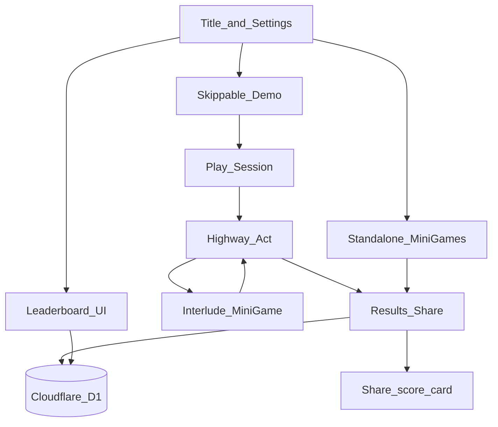
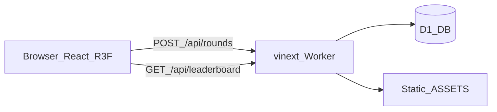

# Architecture

## System flow

## Process topology

1. **Browser** runs the game shell, Three.js scene, Web Audio, and anonymous identity.
2. **Worker** (`worker/index.ts`) serves the vinext App Router handler and optional image optimization.
3. **D1** stores visitors, rounds, leaderboard rows, mastery, and rate-limit windows.

## Module map

| Path | Responsibility |
|---|---|
| `app/page.tsx`, `app/play/page.tsx` | Entry routes |
| `app/ShortcutHeroGame.tsx` | Top-level game shell (being split toward controller + screens) |
| `app/game/` | Pure session FSM, input matching, scoring, content selection |
| `app/gameplay/` | React hooks/controller bridging session ↔ UI |
| `app/components/game/` | R3F scene, keyboard instrument, cue visuals |
| `app/components/session/` | HUD, pause, results |
| `app/components/settings/` | Options model + screen |
| `app/tools/` | Tracks (Linear/Slack/Spotify), registry, themes |
| `app/audio/` | Procedural audio engine |
| `app/identity/` | Anonymous visitor + deletion token |
| `app/persistence/` | Round payload validation, D1 write helpers, client submit |
| `app/api/` | Route handlers (`rounds`, `leaderboard`, …) |
| `app/security/` | Rate limits, security headers |
| `db/` | Drizzle schema + D1 accessors |
| `drizzle/` | SQL migrations applied by Wrangler |
| `worker/` | Cloudflare Worker entry |
| `docs/` | This documentation suite |

## Session ownership

- **Authoritative timing and scoring** live in `app/game/session.ts` (pure functions + session state).
- **React** owns input capture, rAF/tick bridging, and presentation.
- **Server** never re-simulates the highway; it **validates** round payloads and stores aggregates.

## Data ownership

| Concern | Where |
|---|---|
| Live run state | Client memory (`GameSession`) |
| Settings / identity | `localStorage` |
| Durable scores | D1 `rounds` + `leaderboard_entries` |
| Per-shortcut skill | D1 `shortcut_mastery` |
| Abuse control | D1 `rate_limits` |

## Design principles

1. **Tracks are data** — adding Slack/Spotify must not fork the engine.
2. **Themes are tokens** — Golden Signal base + tool accents.
3. **Graceful degradation** — if D1 is unavailable, gameplay still works; persistence returns 503.
4. **`michael` isolation** — ship reviewable increments without merging to `main` until approved.

## Related

- [DATABASE.md](./DATABASE.md)
- [GAME_ENGINE.md](./GAME_ENGINE.md)
- [API.md](./API.md)
