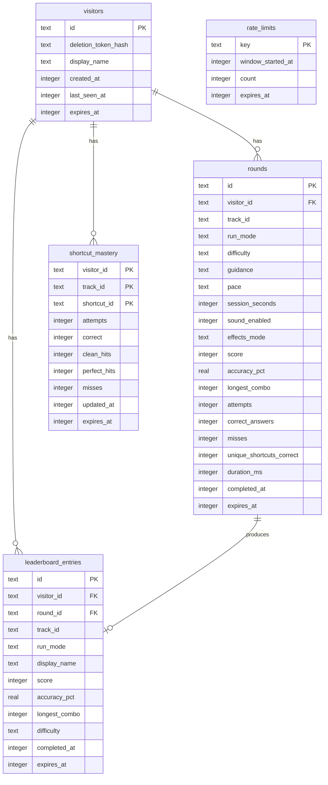

# Database

Shortcut Hero persists progress on **Cloudflare D1** (SQLite) using **Drizzle** for schema definition and SQL migrations under `drizzle/`.

## Binding

| Name | Source |
|---|---|
| `DB` | `.openai/hosting.json` → `"d1": "DB"` |
| Local apply | `wrangler.local.jsonc` + `npm run db:local:setup` |
| Runtime access | `getD1Database()` / `getDb()` in `db/index.ts` |

If the binding is missing, APIs throw `DatabaseUnavailableError` and return **503**.

## Entity-relationship diagram

## Tables

### `visitors`

Anonymous players. Client sends `visitorId` + `deletionToken`; server stores **SHA-256** of the token only.

### `rounds`

One row per submitted run. Includes settings snapshot (`track_id`, `run_mode`, difficulty/guidance/pace, effects) and aggregate stats.

`run_mode` values today: `highway` | `speed_round`.

### `leaderboard_entries`

Denormalized top-score rows for global and per-track queries. Unique on `round_id` so a round cannot double-post.

Indexes:

- `(score, completed_at)` global
- `(track_id, score, completed_at)` per track
- `expires_at` for pruning

### `shortcut_mastery`

Composite PK `(visitor_id, track_id, shortcut_id)`. Updated from round mastery deltas.

### `rate_limits`

Sliding/window counters keyed by `scope:visitorId` (e.g. round writes).

## Retention

Defined in `app/persistence/server.ts`:

| Class | Duration |
|---|---|
| Raw rounds | **90 days** |
| Aggregates (visitors, mastery) | **365 days** |
| Leaderboard rows | **365 days** |

`expires_at` columns support best-effort prune after writes.

## Migration workflow

1. Edit `db/schema.ts`.
2. `npm run db:generate` → new SQL under `drizzle/` + journal update.
3. Local: `npm run db:local:setup`.
4. Production: apply the same migrations with Wrangler against the remote D1 (see [DEPLOYMENT.md](./DEPLOYMENT.md)).

Initial migration on this branch: `drizzle/0000_michael_leaderboard.sql`.

## Local vs production

| | Local | Production |
|---|---|---|
| Persist path | `.wrangler/state` | Cloudflare D1 remote |
| Database id | Placeholder UUID | Real D1 id from project hosting |
| Availability | Requires `db:local:setup` once per machine/state wipe | Requires remote migrate + binding |

## Security notes

- Never store raw deletion tokens.
- Display names are short, pattern-validated (`2–24` chars).
- Round payloads are schema-validated client- and server-side (`round-payload.ts`).
