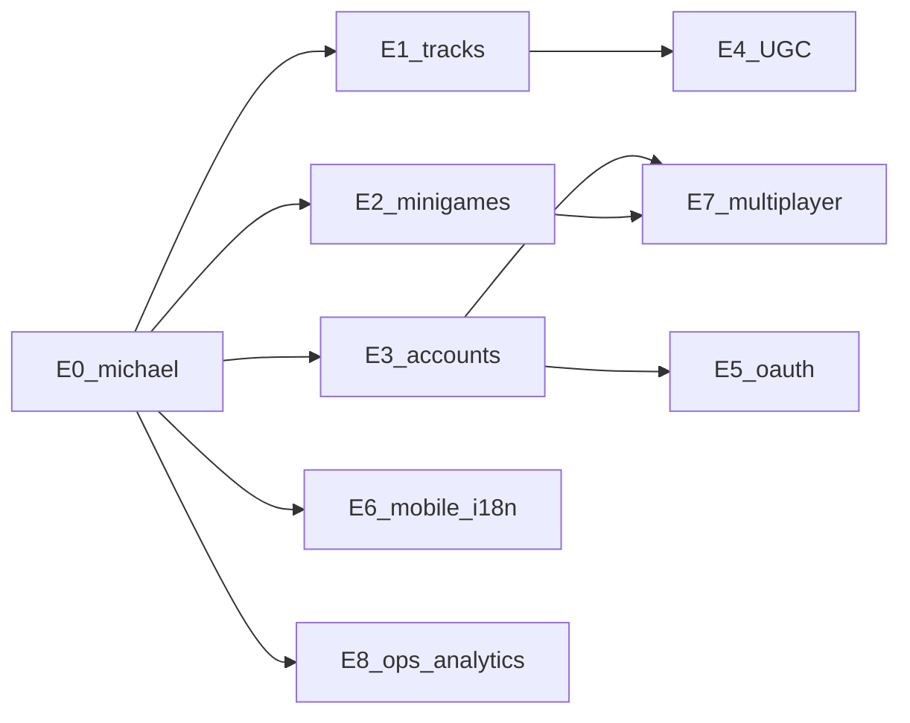

# Extension phased plan (E0–E8)

Long-horizon roadmap beyond day-to-day `michael` implementation. Each phase is fundable and reviewable on its own. **Do not** treat later phases as committed scope for the current review branch.

Related: [PRODUCT_OVERVIEW.md](./PRODUCT_OVERVIEW.md), [DECISIONS.md](./DECISIONS.md), [CONTRIBUTING.md](./CONTRIBUTING.md).

---

## E0 — Michael overhaul (current)

### Goals

- D1 international leaderboard (local Wrangler + prod path)
- Multi-tool tracks: Linear + Slack + Spotify with theme accents
- Progressive speed, clearer cues, streak chain/break FX
- Standalone speed-round + highway interludes
- Skippable demo, shareable results, enterprise `docs/`
- Keep work on **`michael`** for teammate review (no premature `main` merge)

### Non-goals

- Live Slack/Spotify APIs
- Full auth accounts
- Merging to `main` without approval

### Dependencies

- vinext + Cloudflare D1 bindings
- Anonymous identity + round payload validation
- Tool registry + theme tokens

### Schema / API impact

- Tables: `visitors`, `rounds`, `leaderboard_entries`, `shortcut_mastery`, `rate_limits`
- `POST /api/rounds`, `GET /api/leaderboard`
- `runMode`: `highway` | `speed_round`

### UX surfaces

Title, options (tool picker), highway HUD, interludes, results/share, leaderboard

### Risks

- Scope creep delaying reviewability — sequence phases inside E0
- Score spoofing (accept soft trust; validate bounds)
- WebGL performance with added FX

### Metrics

- Review build playable end-to-end on a clean machine (`db:local:setup` → run → board)
- Docs suite complete and linked from root README
- `npm run check` green

---

## E1 — More tracks and deeper theme kits

### Goals

- Ship Notion, Jira, Excel, Superhuman packs (or prioritized subset)
- Richer theme kits (sky tint, particle palettes, results chrome kits)
- Catalog UX for coming-soon vs available

### Non-goals

- User-authored packs (see E4)
- Per-OS shortcut variants in the same deck

### Dependencies

- E0 registry/theme contract stable
- Content research + legal comfort using publicly documented shortcuts

### Schema / API impact

- New `trackId` values only (no migration if ids are free-form text)
- Optional `tracks` metadata table later for remote config

### UX surfaces

Tool picker expansion; themed title moments; pack storefront (lightweight)

### Risks

- Content inaccuracy / product shortcut churn
- Theme kits harming readability

### Metrics

- ≥N additional available tracks with showcase decks
- Track switch rate and completion rate by `trackId`

---

## E2 — Richer mini-games and interlude scripting

### Goals

- New mini-game types: chord hold, reverse recall, boss wave
- Data-driven interlude scripts (timing, game type, difficulty bump)
- Shared result contract hardened across types

### Non-goals

- UGC level editor (E4)
- Multiplayer boss raids (E7)

### Dependencies

- E0 interlude scheduler hooks
- Stable `MiniGameResult` + leaderboard `runMode` taxonomy (may extend enum)

### Schema / API impact

- Possibly extend `run_mode` or add `mini_game_type`
- Optional `interlude_events` debug table (prod likely omit)

### UX surfaces

Quick Play menu; scripted act breaks; results breakdown by act

### Risks

- Mode explosion confusing new players
- Scoring inconsistency across types

### Metrics

- Interlude completion rate; Quick Play retention D1/D7
- Balance: mean score deltas highway-with vs without interludes

---

## E3 — Accounts, friends, seasonal boards, soft anti-cheat

### Goals

- Optional auth profiles (link anonymous visitor → account)
- Friends list / follow; seasonal leaderboards
- Soft anti-cheat: timing sanity, duplicate device signals, server-side heuristics

### Non-goals

- Hard cryptographic attestation of every keypress
- Paid competitive leagues

### Dependencies

- Auth provider decision (ADR)
- Migration path for anonymous → named profiles

### Schema / API impact

- `accounts`, `account_visitors`, `friendships`, `seasons`, `season_scores`
- Auth session endpoints; stricter write auth for ranked modes

### UX surfaces

Sign-in optional banner; profile; friends challenges; season badge on results

### Risks

- Privacy regression; account recovery complexity
- False positive anti-cheat alienating players

### Metrics

- % runs attached to accounts; friend challenge completion; chargeback/abuse rate

---

## E4 — UGC and community packs

### Goals

- Import custom shortcut JSON (validated schema)
- Community pack browser with ratings/report
- Sandboxed content (no code execution)

### Non-goals

- Arbitrary JS mods
- Monetized marketplace at launch of E4

### Dependencies

- E1 theme/track contracts
- Moderation tooling basics

### Schema / API impact

- `content_packs`, `pack_shortcuts`, `pack_reports`, ownership columns
- Size limits + virus/content scanning policy for JSON only

### UX surfaces

Import flow; “My packs”; community gallery; report button

### Risks

- Copyrighted shortcut lists / trademark issues
- Abuse via offensive action names

### Metrics

- Packs created / forked; report rate; play rate of UGC vs first-party

---

## E5 — Live tool deep-links / OAuth-assisted practice

### Goals

- Optional OAuth to tailor practice (“issues you touch in Linear”)
- Deep-link back into the real tool after a run

### Non-goals

- Mutating customer workspaces from the game
- Replacing official training products

### Dependencies

- Partner API access & legal agreements
- E3 accounts strongly recommended

### Schema / API impact

- Encrypted token vault; `external_connections`; sync cursors
- Careful secret handling on Workers

### UX surfaces

Connect tool; “Practice my recents”; disconnect/revoke

### Risks

- Scope creep into productivity suite
- Token leakage; partner ToS violations

### Metrics

- Connect rate; revoke rate; lift in mastery for synced shortcuts

---

## E6 — Mobile, alternative input, i18n, performance budgets

### Goals

- Touch / on-screen keyboard modes for a subset of decks
- Performance budgets documented and enforced
- i18n for UI chrome (shortcut labels may stay English per tool)

### Non-goals

- Full parity of all desktop chords on phones on day one
- Controller support unless requested

### Dependencies

- Input abstraction beyond `KeyboardEvent.code`
- Design QA on small viewports

### Schema / API impact

- Optional `input_method` on rounds for segmented boards

### UX surfaces

Touch strike controls; language picker; quality scaler

### Risks

- Diluting the desktop muscle-memory promise
- Bundle size / WebGL thermal limits

### Metrics

- Mobile session quality (FPS, completion); locale coverage; crash-free sessions

---

## E7 — Multiplayer and async challenge rooms

### Goals

- Async challenge rooms (share seed + score comparison)
- Spectator / share links for a finished run replay (lightweight)
- Optional live presence later

### Non-goals

- Full rollback netcode rhythm PvP at launch of E7

### Dependencies

- E3 identities; durable room state (D1 and/or Durable Objects)

### Schema / API impact

- `challenge_rooms`, `room_members`, `room_scores`; realtime channel decision ADR

### UX surfaces

Create challenge; join code; rematch; spectator

### Risks

- Cheating in competitive rooms; cost of realtime infra

### Metrics

- Challenges created/completed; rematch rate; abuse reports

---

## E8 — Content pipeline, analytics maturity, A/B, observability SLOs

### Goals

- Editorial pipeline for shortcut packs (staging → prod)
- Analytics funnels with experiments (A/B hooks)
- Observability: Worker latency/error SLOs, D1 health, WebGL fail counters

### Non-goals

- Premature microservices split

### Dependencies

- Stable event taxonomy ([ANALYTICS.md](./ANALYTICS.md))
- Feature flag mechanism

### Schema / API impact

- `experiments`, assignment tables; pack versioning columns

### UX surfaces

Mostly invisible; optional “help improve” toggles

### Risks

- Over-instrumentation vs privacy posture
- Experiment debt

### Metrics

- SLO burn rates; time-to-ship a pack; experiment decision cycle time

---

## Sequencing summary

Revisit this document when an ADR changes a dependency arrow.
