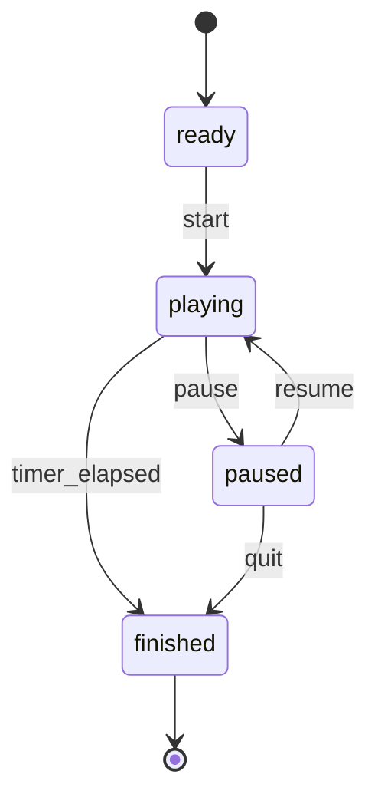

# Game engine

Pure gameplay logic lives under `app/game/`. React hooks in `app/gameplay/` drive ticks and wire UI; the server does not re-simulate sessions.

## Responsibilities

| Module | Role |
|---|---|
| `session.ts` | Session FSM, cue schedule, pause/finish, tempo factor |
| `input.ts` | Key capture policy + single/sequence/chord matching |
| `scoring.ts` | Judgement points, combo tiers/multipliers, results rollup |
| `content.ts` | Deck selection for mode/track |
| `types.ts` | Shared domain types |

## Session phases

`SessionPhase`: `ready` | `playing` | `paused` | `finished`.

## Cue lifecycle

1. **Queue** shortcuts from the selected deck (with requeue of misses).
2. Assign `approachedAtMs`, `strikeAtMs`, `deadlineAtMs` from pace + tempo factor.
3. At most one **active** prompt for input; additional cues may be **visible** for anticipation.
4. On correct match → score, combo update, effects; on miss/timeout → practice bookkeeping and later requeue.
5. Session ends when duration elapses — runs do not end early on mistakes.

## Input kinds

| Kind | Completion rule |
|---|---|
| `single` | Matching `code` |
| `sequence` | Ordered codes with ≤ `maxGapMs` (default 1000 ms) between keys |
| `chord` | Letter while `shift` held |

Browser/OS chords (Cmd/Ctrl/Option) are protected from capture where configured.

## Pace and progressive tempo

Base approach durations (`APPROACH_DURATION_MS`):

| Pace | Approach |
|---|---:|
| `relaxed` | 1600 ms |
| `standard` | 1000 ms |
| `turbo` | 800 ms |

Cadence also varies by difficulty (`PROMPT_CADENCE_BY_MODE_MS`).

**Tempo factor** (`getTempoFactor`): starts at `1.0` and eases toward ~`1.55` over the session so cues arrive faster late in the run without changing the selected pace preset label.

## Scoring

Judgement base points (`scoring.ts`):

| Judgement | Points |
|---|---:|
| perfect | 200 |
| good | 150 |
| early / late | 100 |

Combo multipliers: base ×1, trail (3+) ×2, surge (6+) ×3, flow (9+) ×4.

Recovered hits: ×0.5, do not continue combo, counted as practice misses in summaries.

## Results contract

`GameResults` includes score, accuracy, longest combo, correct/practice lists, attempt history — consumed by Results UI and round persistence mapping.

## Effects bus

Session emits lightweight `GameEffect` events (hit, miss, combo tier changes) for scene FX and audio — presentation stays outside the pure core.

## Testing

Unit coverage targets session transitions, scoring, and input matching (`app/game/session.test.ts` and related). Add tests when changing tempo math or judgement windows.
